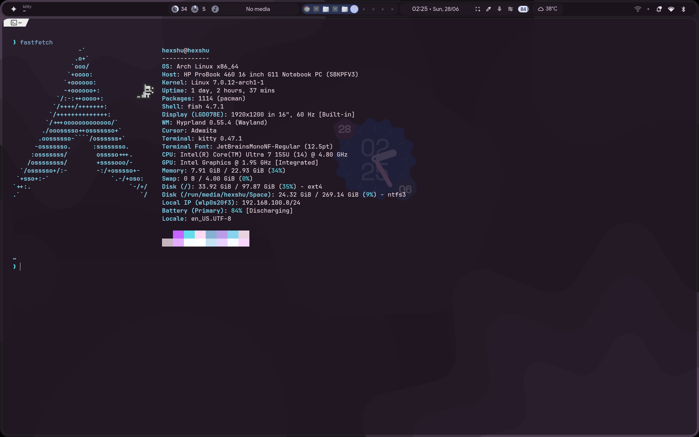
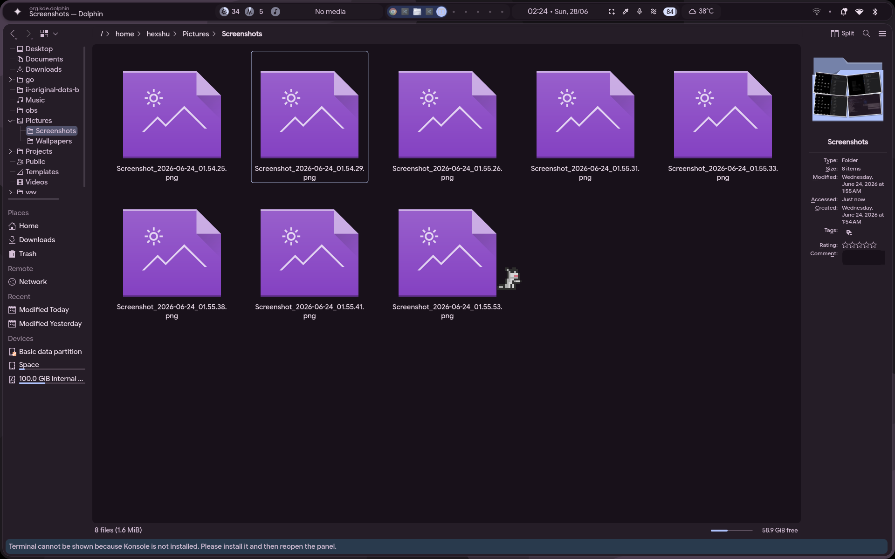
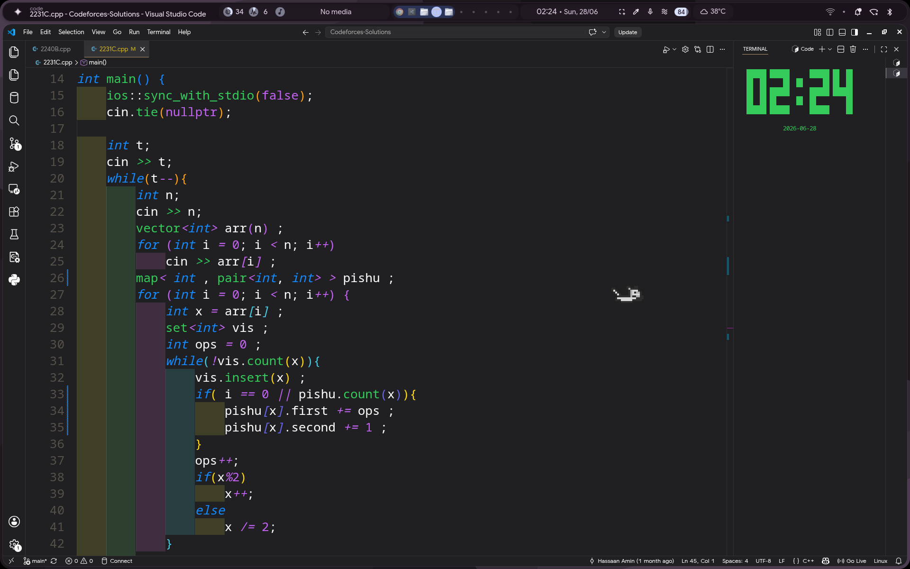

# Cato

>  built for **Arch Linux + Hyprland**.
Working on Arch with Hyprland combo 


Cato is a tiny desktop cat that lives on your screen and follows your mouse cursor. It walks, runs, idles with different animations, and stays pinned above all your windows without stealing focus.


More animations and interactions are planned.


```md
| arch | idk_lol |
|:-----|:--------|
|  |  |
| licking | running |
|  |  |
```

## Requirements

* Arch Linux (or another Linux distribution running Hyprland 💀 should work )
* Hyprland
* Go

## Hyprland Configuration

Add the following window rules to your Hyprland config:

```lua
hl.window_rule({match = {title = "^(cato)$"}, no_focus = true})
hl.window_rule({match = {title = "^(cato)$"}, float = true})
hl.window_rule({match = {title = "^(cato)$"}, pin = true})
hl.window_rule({match = {title = "^(cato)$"}, no_shadow = true})
hl.window_rule({match = {title = "^(cato)$"}, no_blur = true})
hl.window_rule({match = {title = "^(cato)$"}, no_initial_focus = true})
hl.window_rule({match = {title = "^(cato)$"}, no_anim = true})
hl.window_rule({match = {title = "^(cato)$"}, move = {0, 0}})
```

Reload Hyprland after adding the rules.

```
hyprctl reload
```

## Running

Clone the repository, then run:

```bash
go mod tidy
go run .
```

## Contribution

Contributions are always welcome!!!!!!!!!!!

If you'd like to add new animations, behaviors, features, improve the codebase, or fix bugs, feel free to open a pull request.

I'd especially love contributions that make **Cato work on more Linux distributions and desktop environments**, not just the current Arch Linux + Hyprland setup.
